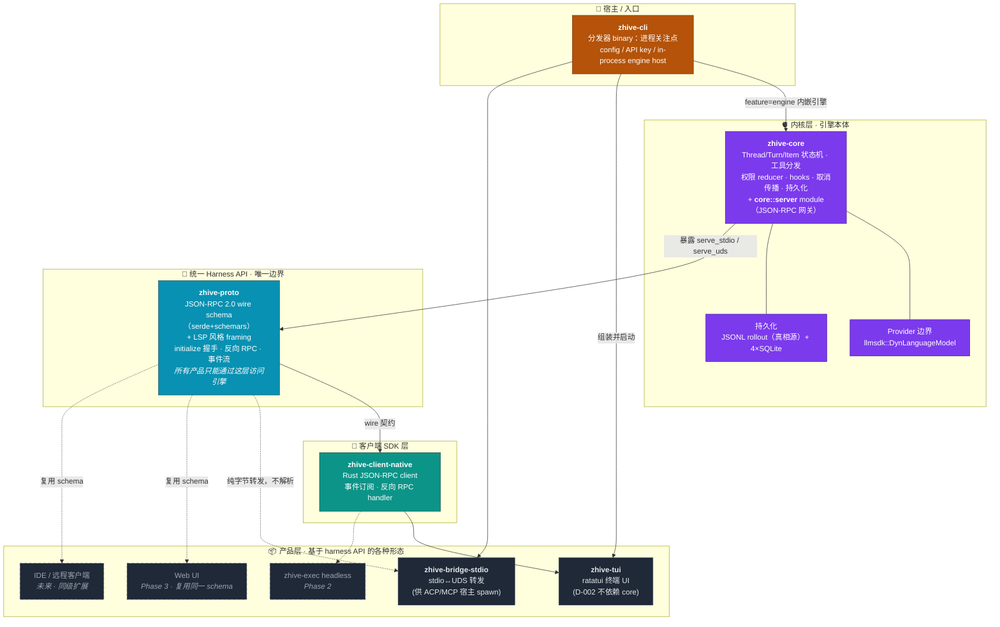
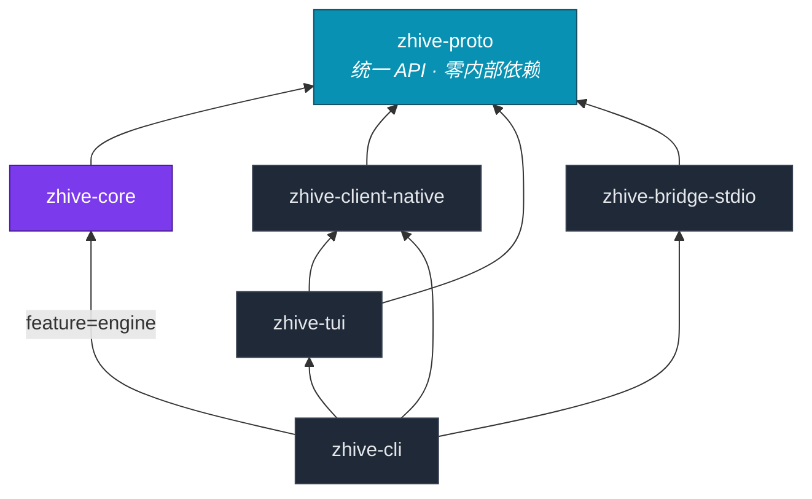
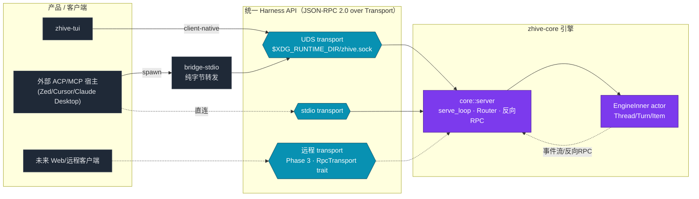
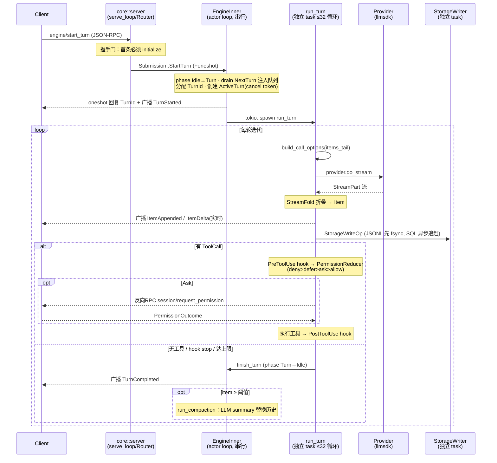

# zhive 架构

zhive 是一个 Rust 编写的终端 AI 协作 agent，核心是**一个引擎 + 多客户端**的 daemon 式架构。
设计的轴心：**`zhive-core` 是内核 → 凝结成 `zhive-proto` 这套统一 harness API → 基于它可以长出任意产品，TUI 只是第一个。**

> 所有架构决策的权威来源是 [`research/99-decisions/README.md`](research/99-decisions/README.md)（D-001 ~ D-015）。本文是对其落地结构的可视化导览。当前处于 **Phase 1**。

---

## 设计哲学

1. **协议即唯一边界** —— 任何客户端（连同进程内 TUI）都只能通过 `zhive-proto` 的 wire schema 访问引擎，杜绝内存捷径，确保所有产品自动同级。
2. **adapter 隔离上游风险** —— 不稳定的外部生态依赖（ConnectRPC/rmcp/ACP/a2a）被挡在 bridge crate 外，并用"单维护者+pre-1.0 即拒收/精确锁"的统一标尺管理（D-003/005/015）。
3. **该拆的一开始就拆，该收敛的坚决收敛** —— SQLite 4 库从第一天就分（避免日后 migration 学费），但 crate 数从 12 砍到 7（避免 import 折磨）。
4. **每个扩展方向都有 trait 留口但不空建 crate** —— Phase 2/3 的能力在 schema/trait 层已预留承载位，但不提前造空壳。

---

## 图 1：从核心向外扩展的分层架构

**读图要点（从内向外）：**
- **内核 `zhive-core`** 是一切的源头——引擎状态机 + 内嵌的 JSON-RPC server module。
- 引擎能力凝结成 **统一 harness API（`zhive-proto`）**，这是**唯一边界**：任何产品、连同内嵌 TUI，都只能通过这层 wire schema 访问引擎，没有内存捷径。
- 往外是 **客户端 SDK（native）** 和**各种产品形态**——TUI 只是其中之一，与 Web/IDE/远程/headless 同级。
- `zhive-cli` 是**宿主入口**而非顶层依赖：它负责进程关注点（配置、密钥、把引擎和产品组装起来），但引擎和 UI 都不依赖它。

---

## 图 2：依赖方向（谁依赖谁）

> 箭头 = "依赖"。注意 **`zhive-tui` 不依赖 `zhive-core`**（D-002）——它只依赖 client + proto，证明"TUI 只是 harness API 的一个消费者"。`zhive-proto` 是图的汇聚点：所有人都指向它，它谁也不依赖。

---

## 图 3：运行时——同一套 API，多种接入路径

**核心信息**：引擎对外只暴露一套 harness API，但 API 可以走多种 transport（UDS / stdio / 未来远程）。不同产品按自己的接入能力选择路径——TUI 走 UDS，只能 spawn 子进程的编辑器走 bridge-stdio 转发，未来 Web/远程走 `RpcTransport` 抽象的新 transport。**新增一种产品 = 在这套 API 上加一个消费者，引擎零改动。**

---

## 图 4：一次 Turn 的运行时数据流

**关键运行时设计：**
- **Actor 模型**：`EngineInner` 串行消费 `Submission`，`start_turn` 立即回 `TurnId` 后把实际 turn `spawn` 出去，保证 actor loop 始终能响应 `CancelTurn`。
- **三层原语 Thread→Turn→Item**（D-006），Item 含 reasoning/tool_call/exec/file_edit/agent_message/diff/terminal/thought。
- **反向 RPC**（D-008）：权限审批走 server-initiated request，与事件同一条 stream。四态 reducer；subagent 强制继承父 scope 且只能缩窄。
- **三条注入队列**（Pi 模型）：Steer（每次 LLM call 前）/ FollowUp（turn 边界）/ NextTurn（下轮，abort 不清空）。
- **取消传播树**：Engine→Turn→Tool/Hook/Subagent 层级 CancellationToken。
- **持久化 JSONL-first**（D-011）：rollout JSONL 是真相源（带 Leaf 指针支持 fork），4 个 SQLite 库（state/logs/memories/goals）异步追赶。

---

## Crate 一览

| Crate | 角色 | 依赖 | 备注 |
|---|---|---|---|
| `zhive-proto` | **统一 harness API**：wire schema + framing | 无内部依赖 | 汇聚点，唯一边界 |
| `zhive-core` | 引擎本体 + 内嵌 `core::server` | proto | server 非独立 crate |
| `zhive-client-native` | Rust JSON-RPC client | proto | D-002 不依赖 core |
| `zhive-tui` | ratatui 终端 UI | client-native, proto | 协议的普通消费者 |
| `zhive-bridge-stdio` | ~90 行 stdio↔UDS 纯字节转发 | proto | 禁止解析 JSON-RPC |
| `zhive-cli` | 分发器 binary（宿主入口） | tui/bridge/core(feature) | 进程关注点 |
| `xtask` | 构建/迁移工具 | 独立 | 不引 acp/rmcp |

---

## 扩展点（已留口的方向）

| 扩展维度 | 机制 | 状态 |
|---|---|---|
| 新客户端（Web/IDE/远程） | proto + client，D-002 平级 | TUI 已验证 |
| 新 transport（远程/TLS） | `Transport` / `RpcTransport` trait | stdio+UDS 已实现 |
| 新生态协议（MCP/ACP） | bridge crate + adapter trait，精确锁版本 | bridge-stdio 已实现 |
| 新 LLM provider | `llmsdk::DynLanguageModel`（不自造 trait） | Anthropic/OpenAI/Scripted |
| 新工具 | `Tool` trait + `ToolRegistry` | read/write/edit/grep/glob/agent/bash 内置 |
| 用户扩展（extension/prompt/skill） | manifest 统一发现（D-013），三层 settingSources | schema 已定 |
| Hooks | 14+ 事件，`#[non_exhaustive]`（D-012） | 已预留 5 个 Phase 2/3 事件 |
| 协议演进 | initialize + v1/v2 + 独立 capability flag（D-007） | 已实现 |
| 可观测性 | tracing spans 进核心，OTel exporter feature gate（D-014） | observability.rs |

### 三阶段路径（D-010）

- **Phase 1（当前）**：core 引擎 + proto + client-native + tui + cli + bridge-stdio + ACP minimal conformance harness。
- **Phase 2（生态接入）**：`zhive-mcp`（rmcp 1.6）、`zhive-bridge-acp`（ACP 0.13 read+write）、`zhive-exec` headless、扩展系统落地。
- **Phase 3（扩展）**：Web UI（复用 schema）、远程 TLS / 云沙箱、ConnectRPC 候选评估、A2A AgentCard schema 占位（手写 JSON，不引 a2a-rs）。
