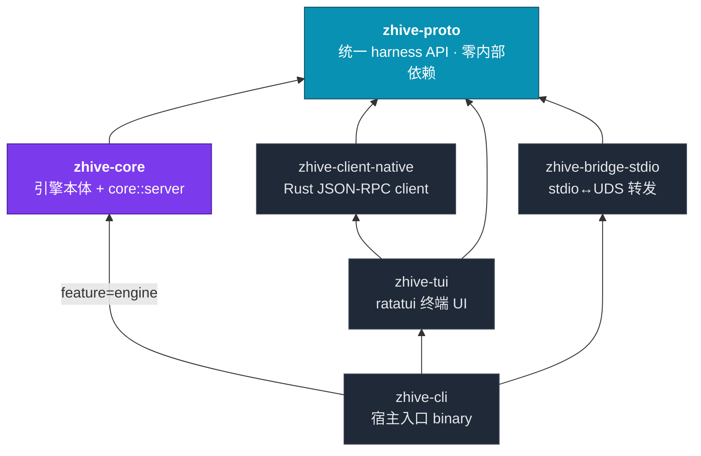

<div align="center">

# zhive

**终端里的 AI 协作 agent —— 一个引擎,任意客户端。**

[](LICENSE)
[](https://www.rust-lang.org)
[](https://doc.rust-lang.org/edition-guide/)
[](ARCHITECTURE.md)

</div>

---

zhive 是一个用 Rust 编写的终端 AI 协作 agent。它的核心不是某一个界面,而是一台 **daemon 式的 agent 引擎**:`zhive-core` 负责 Thread / Turn / Item 状态机、工具分发、权限审批、持久化与取消传播;所有能力凝结成 `zhive-proto` 这一套 **JSON-RPC harness API**,作为访问引擎的**唯一边界**。

> **设计轴心**:`zhive-core` 是内核 → 凝结成 `zhive-proto` 统一 harness API → 基于它可以产出任意产品形态。终端 UI(`zhive-tui`)只是第一个消费者,与未来的 Web / IDE / 远程客户端**完全同级**——没有内存捷径,谁都只能走协议。

完整的分层架构、依赖方向、运行时数据流(4 张图)见 **[ARCHITECTURE.md](ARCHITECTURE.md)**;所有架构决策的权威来源是 **[research/99-decisions](research/99-decisions/)**(D-001 ~ D-015)。

---

## ✨ 特性

- **协议即唯一边界** —— 任何客户端(连同进程内 TUI)只能通过 `zhive-proto` 的 wire schema 访问引擎,所有产品形态自动同级。
- **Actor 式引擎** —— `EngineInner` 串行消费 submission,`start_turn` 立即返回 `TurnId` 后把实际 turn `spawn` 出去,确保随时可响应取消。
- **三层原语 Thread → Turn → Item** —— Item 涵盖 reasoning / tool_call / exec / file_edit / agent_message / diff / terminal 等类型。
- **多 Provider** —— 经 [`llmsdk`](https://github.com/zerx-lab/llmsdk) 接入 Anthropic / OpenAI / xAI / Scripted(离线脚本回放),配置数据驱动,可自由扩展。
- **内置编码工具** —— `read` / `write` / `edit` / `grep` / `glob` / `agent`(子 agent),以及可选的 `bash`(支持沙箱开关)。
- **权限 reducer + Hooks** —— 工具调用前过 `PreToolUse` hook 与四态权限 reducer(`deny > defer > ask > allow`);审批走**反向 RPC**,与事件同一条流;subagent 强制继承父 scope 且只能缩窄。
- **三条注入队列** —— Steer(每次 LLM call 前)/ FollowUp(turn 边界)/ NextTurn(下一轮,abort 不清空)。
- **JSONL-first 持久化** —— rollout JSONL 是真相源(带 Leaf 指针支持 fork),4 个 SQLite 库(state / logs / memories / goals)异步追赶。
- **可编辑的提示词** —— 系统提示与压缩提示从 `.j2`(Jinja2)模板渲染,支持按 provider 选择 persona、动态变量注入与磁盘覆盖。
- **多种接入路径** —— 同一套 API 可走 UDS / stdio transport;只能 spawn 子进程的编辑器经 `bridge-stdio` 纯字节转发接入。

---

## 🏗 架构速览



箭头 = 依赖方向。`zhive-proto` 是图的汇聚点:所有人都指向它,它谁也不依赖。注意 **`zhive-tui` 不依赖 `zhive-core`**——它只依赖 client + proto,证明 TUI 只是 harness API 的一个普通消费者。

---

## 🚀 快速开始

> **前置**:Rust 1.89+ / edition 2024。

```bash
# 1. 构建
cargo build --release -p zhive-cli

# 2. 生成一份带注释的示例配置(不会覆盖已存在的文件)
zhive config init

# 3. 配置 provider 的 API key —— 默认从环境变量读取
export ANTHROPIC_API_KEY=sk-...        # 或 OPENAI_API_KEY=...

# 4. 自检:打印当前配置与能力概览
zhive doctor

# 5. 启动交互式终端 UI(默认子命令)
zhive
```

配置走分层模型:`[provider.<name>]` 下声明任意命名后端,`[provider].default` 选择当前激活项;每个 provider 用 `kind` 选后端工厂(`anthropic` / `openai` / `scripted` …),`api_key_env` 指定从哪个环境变量读密钥。配置文件默认位于 `~/.config/zhive/config.toml`(遵循 `$XDG_CONFIG_HOME`,可用 `zhive config path` 查看);引擎数据(rollout JSONL 与 SQLite 库)则落在 `~/.local/share/zhive`(遵循 `$XDG_DATA_HOME`)。

无需进入 UI,也可以非交互执行单条提示(适合脚本 / CI):

```bash
zhive exec -p "总结这个仓库的 README" --provider anthropic --model claude-sonnet-4-6
```

---

## 🧭 命令一览

| 命令 | 作用 |
|---|---|
| `zhive` / `zhive tui` | 启动交互式终端 UI(默认) |
| `zhive exec -p "<prompt>"` | 非交互执行单条提示,结果打到 stdout |
| `zhive serve` | 以 daemon 形式在 Unix socket 上提供 JSON-RPC 服务 |
| `zhive bridge` | 把 stdio 转发到运行中的引擎 socket(供编辑器 / ACP / MCP 宿主 spawn) |
| `zhive acp` | 在 stdio 上以 ACP 协议提供引擎服务(供 ACP 编辑器宿主接入) |
| `zhive config <path\|init>` | 查看解析后的配置路径 / 写出示例配置 |
| `zhive doctor` | 打印当前配置与能力的诊断摘要 |

TUI 与 `exec` 支持 `--provider` / `--model` 覆盖;TUI 另支持 `--theme`(`dark` / `light` / `mono`)与 `--accent`(`cyan` / `amber` / `lime` / `magenta`)。

---

## 📦 Crate 一览

| Crate | 角色 | 依赖 |
|---|---|---|
| `zhive-proto` | **统一 harness API**:wire schema + LSP 风格 framing | 无内部依赖 |
| `zhive-core` | 引擎本体 + 内嵌 `core::server`(JSON-RPC 网关) | proto |
| `zhive-client-native` | Rust JSON-RPC client(事件订阅 + 反向 RPC handler) | proto |
| `zhive-tui` | ratatui 终端 UI | client-native, proto |
| `zhive-bridge-stdio` | ~90 行 stdio↔UDS 纯字节转发(禁止解析 JSON-RPC) | proto |
| `zhive-cli` | 分发器 binary(宿主入口:config / API key / 进程组装) | tui / bridge / core(feature) |
| `zhive-mcp` | MCP 客户端:连接 MCP server 并把其工具适配为引擎工具 | proto, core |
| `zhive-bridge-acp` | ACP agent:进程内内嵌引擎,经 ACP 对外提供服务 | proto, core |
| `xtask` | 构建 / 迁移工具 | 独立 |

---

## 🗺 路线图

按 **三阶段路径(D-010)** 推进。每一阶段对应一组能力,详见 [ARCHITECTURE.md](ARCHITECTURE.md)。

- **Phase 1 ·(当前)** —— core 引擎 + proto + client-native + tui + cli + bridge-stdio,内置编码工具、系统提示、持久化均已落地。
- **Phase 2 · 生态接入(进行中)** —— `zhive-mcp`(MCP)与 `zhive-bridge-acp`(ACP)已实现并带一致性测试,正在收尾;`zhive-exec` headless 与用户扩展系统(skill / command / hook)落地中。
- **Phase 3 · 扩展** —— Web UI(复用同一 schema)、远程 TLS / 云沙箱、A2A AgentCard schema 占位。

> 说明:引擎与协议层已达生产级,但端到端的真实对话链路仍在持续打磨中——能力声明以各自的 phase 标签为准。

---

## 🛠 开发约定

本仓库遵循一套严格的工程红线(详见 [CLAUDE.md](CLAUDE.md)):

- **新增依赖需先说明理由并确认**;统一通过 `[workspace.dependencies]` 声明,版本对齐由 workspace 收口。
- 业务代码**禁止 `unwrap()` / `expect()` / `unsafe`**;错误用 `?` + `thiserror`。
- 公开 API 必须有 doc comment + 至少一个 doctest 或 example。
- 提交前必须通过 `cargo fmt --check && cargo clippy -- -D warnings`。

常用命令:

```bash
cargo check -p <crate> --lib          # 优先单 crate 验证,不跑整个 workspace
cargo nextest run -p <crate>          # 跑测试(单元/集成)
cargo test --doc -p <crate>           # nextest 不跑 doctest,需单独跑
cargo fmt --check && cargo clippy -- -D warnings
```

---

## 📄 License

[Apache-2.0](LICENSE) © zhive contributors
